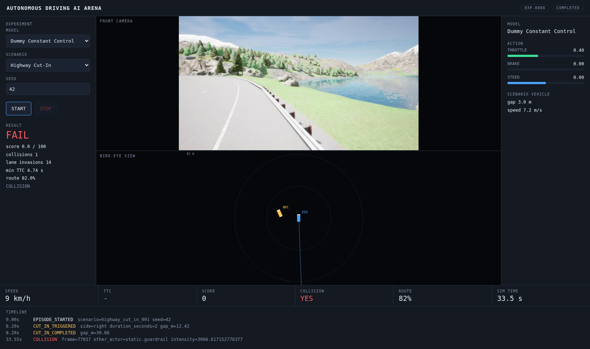

# Autonomous Driving AI Arena

A GPU-accelerated closed-loop simulation platform for testing autonomous driving
models against interactive traffic scenarios using CARLA.

CARLA supplies the 3D world, vehicle physics, traffic and sensors. This project
supplies everything around it: the simulation orchestrator, a scenario engine
driven by YAML, a model adapter layer that keeps the simulator ignorant of what
a "driving model" actually is, a deterministic evaluation engine, and a web
dashboard to watch it all happen.

The core loop the platform is built around:

```
Observation_t  ->  Driving Policy  ->  Action_t  ->  CARLA  ->  Observation_t+1
```

## Status

**Phase 9 of 14 complete - Replay.**

- **Phase 1** - headless CARLA server pinned to a single GPU, Python 3.11
  client, end-to-end smoke test. See [docs/PHASE1.md](docs/PHASE1.md).
- **Phase 2** - the closed loop itself: a synchronous fixed-timestep worker
  that turns observations into actions through a `DrivingPolicy` and back into
  the vehicle, with a safety envelope around whatever the model returns. See
  [docs/PHASE2.md](docs/PHASE2.md).
- **Phase 3** - models run as separate gRPC services. The same episode gives
  the same trajectory whether the model is in-process or across a socket. See
  [docs/PHASE3.md](docs/PHASE3.md).
- **Phase 4** - YAML scenarios with a trigger/action registry, and the Highway
  Cut-In. See [docs/PHASE4.md](docs/PHASE4.md).
- **Phase 5** - deterministic evaluation: collision, TTC, lane invasion, route
  completion, comfort and a 0-100 score. See [docs/PHASE5.md](docs/PHASE5.md).
- **Phase 6** - REST API, PostgreSQL and an experiment state machine. See
  [docs/PHASE6.md](docs/PHASE6.md).
- **Phase 7** - live dashboard: camera and telemetry over WebSocket, start and
  stop from the browser. See [docs/PHASE7.md](docs/PHASE7.md).
- **Phase 8** - canvas bird-eye view drawn from telemetry.
  See [docs/PHASE8.md](docs/PHASE8.md).
- **Phase 9** - frame recording, Alembic migrations and a replay page with
  play/pause/scrub. See [docs/PHASE9.md](docs/PHASE9.md).

Learned models and the model arena land in later phases. Nothing in
this repo is a placeholder: if a directory exists, the code in it runs.



Every number in that screenshot is live: the CARLA render, the bird-eye view
drawn from the same telemetry stream, DummyAgent's constant throttle, the
cut-in that fired at 12.15 m, and the collision that ended the run.


## Verified Runs

Real output from this machine, not illustrations. Every phase doc carries the
full log; this is the short version.

**Environment**: Ubuntu 20.04.6 (glibc 2.31), 4x RTX PRO 6000 Blackwell,
driver 575.57.08, CARLA 0.9.16, Python 3.11.15, PostgreSQL 16.2. No Docker on
this host, so everything runs bare-metal.

<details>
<summary><b>Phase 1 - CARLA smoke test</b></summary>

```
$ make smoke
CARLA connection successful  client 0.9.16 / server 0.9.16
Map loaded                   Carla/Maps/Town04
Sync mode enabled            fixed_delta_seconds=0.05 (20 steps/s)
Vehicle spawned              vehicle.tesla.model3 id=397 spawn_point=0
Camera active                800x450 fov=90 @10Hz
Vehicle moved                displacement 24.1 m, peak speed 6.4 m/s
Vehicle stopped              final speed 0.00 m/s
20 frames received           saved to output/smoke_test/ (received 73 total)
Cleanup successful           actors destroyed, server back in async mode

  [PASS] frames_saved
  [PASS] frames_not_blank
  [PASS] vehicle_moved
  [PASS] vehicle_stopped

Phase 1 smoke test: PASS (12.6s)
```

Frames verified as real renders, not black: pixel std 54.3, full 0-255 range,
and 11.05 mean absolute difference between frame 1 and frame 20 - the world is
moving.
</details>

<details>
<summary><b>Phase 3 - the same episode, model in-process vs over gRPC</b></summary>

| | in-process | over gRPC |
|---|---|---|
| ticks | 400 | 400 |
| distance | 88.5 m | **88.5 m** |
| avg / max speed | 4.4 / 8.3 m/s | 4.4 / 8.3 m/s |
| inferences | 200 | 200 |
| latency p50 | 0.005 ms | 1.473 ms |
| latency p95 | 0.007 ms | 3.207 ms |

Identical trajectory across a process boundary. That equality is the whole
point of the phase: the boundary costs latency and nothing else.

Deadline enforcement, with a model built to miss its budget every fourth call:

```
model_id         slow-camera
required_sensors ('rgb_front',)
health_check     True
inferences       60
model_timeouts   15          <- exactly every 4th call
invalid_actions  15          <- each timeout fell back safely
latency p50/p95  7.9 / 505.5 ms   <- the 500 ms deadline is what cut it off
```
</details>

<details>
<summary><b>Phase 4/5 - Highway Cut-In, scored</b></summary>

```
$ make cut-in
episode EP-CUTIN: policy=dummy duration=40s sim=20Hz inference=10Hz
scenario highway_cut_in_001 (Highway Cut-In) map=Town04 seed=42

status              COMPLETED (COLLISION)
cut-in triggered    YES at 6.05s
collisions          1
ticks               672 (33.6s simulated in 23.1s wall)
distance            253.6 m

minimum TTC         4.55 s
lane invasions      14
route completion    82.0%
RESULT              FAIL   score 0.0 / 100
```

The manoeuvre itself, from per-tick telemetry (lateral: -3.5 m is the left
lane, 0 is the ego's lane):

| t (s) | gap (m) | lateral (m) | |
|---|---|---|---|
| 0.00 | -26.4 | -6.5 | NPC starts behind, in the left lane |
| 6.05 | +12.6 | -3.5 | **trigger fires** |
| 8.05 | +31.1 | -1.8 | cut-in completes |
| 11.00 | +56.3 | +0.1 | settled in the ego's lane |

Three consecutive runs gave an identical trigger time (6.05 s), gap (12.15 m),
tick count (672) and distance (253.6 m).

DummyAgent failing is the expected result: it steers a constant 0, so it
wanders across 14 lane markings and hits a guardrail. That is what makes it
useful as a negative control.
</details>

<details>
<summary><b>Phase 6 - an experiment over HTTP</b></summary>

```
$ curl -X POST localhost:8000/api/experiments \
    -d '{"model_id":"dummy","scenario_id":"highway_cut_in_001","seed":42}'
  201  EXP-0001  status=CREATED

$ curl -X POST localhost:8000/api/experiments/EXP-0001/start
  200  status=STARTING  ->  RUNNING  ->  COMPLETED  (~20 s)

$ curl localhost:8000/api/experiments/EXP-0001
  versions: {git_commit: 9ad9263, carla_client: 0.9.16,
             carla_server: 0.9.16, scenario_version: "1.0"}

$ curl localhost:8000/api/experiments/EXP-0001/episodes
  collision=true  minimum_ttc=4.548  route_completion=82.00%
  lane_invasions=14  ticks=672  distance=253.58 m
  model_latency p50=1.505 ms p95=2.226 ms  result=FAIL  score=0.0
```

The API path and the CLI path agree exactly - 672 ticks, 253.58 m, 82.00%
route, cut-in at 6.05 s. Only latency differs, because the model is reached
over gRPC.

The state machine refuses illegal moves rather than applying them:

```
$ curl -X POST localhost:8000/api/experiments/EXP-0001/start   # already COMPLETED
409 {"detail":"EXP-0001: COMPLETED -> STARTING is not allowed
     (legal: none, this state is terminal)"}
```
</details>

<details>
<summary><b>Phase 7/8 - live dashboard</b></summary>

WebSocket against a live episode:

```
created EXP-0007
started
stream ended
ticks=673 camera_frames=336 heartbeats=8
avg jpeg = 27.4 KB
events: [(0.0, 'EPISODE_STARTED'), (6.05, 'CUT_IN_TRIGGERED'),
         (8.05, 'CUT_IN_COMPLETED'), (33.55, 'COLLISION')]
```

336 frames out of 673 ticks is exactly the 10 Hz camera against the 20 Hz
world.

Verified in a real browser on a display-less machine - headless Chromium clicks
START and waits for an actual camera `` to appear before shooting, so the
screenshot only exists if CARLA, gRPC, the worker, the socket and React all
worked:

```
$ uv run python scripts/capture_dashboard.py
captured docs/images/dashboard-idle.png
first camera frame received in the browser
captured docs/images/dashboard-running.png
captured docs/images/dashboard-result.png
```
</details>

<details>
<summary><b>Phase 9 - replay</b></summary>

```
$ curl localhost:8000/api/experiments/EXP-0009/replay
experiment   EXP-0009 | result FAIL | score 0.0
ticks        672 | telemetry rows 672
has_frames   True | frame count 337
events       [(0.0, 'EPISODE_STARTED'), (6.05, 'CUT_IN_TRIGGERED'),
              (8.05, 'CUT_IN_COMPLETED'), (33.55, 'COLLISION')]

$ ls output/experiments/EXP-0009/camera_front | wc -l
337
$ du -sh output/experiments/EXP-0009
10M

$ uv run python scripts/capture_replay.py EXP-0009
recorded frame rendered
after 6 s of playback: tick 120 / 671
```

120 ticks in 6 seconds is 20 ticks/s - real-time playback of a 20 Hz recording.

Schema changes go through Alembic rather than dropping the database:

```
INFO  [alembic.runtime.migration] Running upgrade 0001 -> 0002, Frame recording
migrate -> upgraded
experiments columns include record_frames: True
frames table exists: True
existing experiments preserved: 8
```
</details>

<details>
<summary><b>Test suite</b></summary>

```
$ make test
120 passed in 2.42s
```

No CARLA required - the suite covers the safety envelope, the gRPC protocol
against a real loopback server, scenario geometry and triggers, the scoring
arithmetic, and the experiment state machine.
</details>

## Requirements

| | |
|---|---|
| OS | Ubuntu 20.04+ (verified on 20.04.6, glibc 2.31) |
| GPU | NVIDIA with Vulkan support (verified on RTX PRO 6000 Blackwell, driver 575.57) |
| Python | 3.11 (the CARLA wheel is `manylinux_2_31`, cp310-cp312) |
| CARLA | 0.9.16 packaged release, ~8 GB download / ~18 GB unpacked |
| Database | PostgreSQL 16 - installed by `uv` via the `pgserver` wheel, no root |
| Node | 22 (dashboard only; installed to local disk, see `scripts/fe-install.sh`) |
| Tooling | [uv](https://github.com/astral-sh/uv) |

You do **not** need Unreal Engine, an Epic Games account, or a CARLA source
build. The packaged release ships a precompiled UE4 runtime.

Docker is not required either. This host has no Docker access, so everything
runs bare-metal; see [docs/PHASE1.md](docs/PHASE1.md).

## Quick Start

```bash
cp .env.example .env      # adjust CARLA_ROOT / CARLA_GPU for your machine
make env                  # create the uv venv and install dependencies
make install-carla        # download and unpack the CARLA server
make carla-start          # start CARLA headless on the configured GPU
make smoke                # Phase 1 acceptance test
make carla-stop
```

Then the API and a full experiment over HTTP:

```bash
make model-dummy &         # the model, as its own gRPC service
make api                   # REST on :8000, starts PostgreSQL itself

curl -X POST localhost:8000/api/experiments \
  -H 'Content-Type: application/json' \
  -d '{"model_id":"dummy","scenario_id":"highway_cut_in_001","seed":42}'
curl -X POST localhost:8000/api/experiments/EXP-0001/start
curl localhost:8000/api/experiments/EXP-0001/metrics
```

Interactive docs at `http://localhost:8000/docs`.

`make smoke` connects to the server, loads Town04, spawns a Tesla Model 3,
attaches the front RGB camera, saves 20 frames, drives the car under throttle,
brakes it to a standstill and cleans up every actor. It exits non-zero if any
of those steps fails its numeric threshold.

## Layout

```
simulator/
  types.py                   Observation, VehicleControlAction, EpisodeResult
  policy.py                  the DrivingPolicy interface
  worker.py                  the closed-loop episode runner
  carla_client.py            connection and synchronous-world lifecycle
  ego.py, sensors.py         ego spawning, camera and collision sensors
  scenario.py                YAML scenarios: trigger/action registries
  metrics.py                 deterministic evaluation and scoring
  route.py                   route generation and completion
  npc.py                     lane-following controller for scenario vehicles
backend/
  main.py                    FastAPI app, syncs YAML registries into the DB
  experiment_manager.py      the sole owner of experiment state
  database/models.py         experiments, episodes, events, metrics
  api/routes.py              REST endpoints
model_gateway/
  protocol/driving.proto     the simulator <-> model contract
  server.py                  serve any DrivingPolicy over gRPC
  adapters/remote.py         a remote model, as a local policy
models/
  dummy/policy.py            constant-control baseline
  dummy/service.py           the same policy as a gRPC service
configs/
  models.yaml                model registry: id, type, endpoint
  simulator/carla.yaml       server connection, map, fixed timestep, GPU
  simulator/ego.yaml         ego blueprint and target speed
  simulator/episode.yaml     duration, inference rate, weather
  sensors/front_camera.yaml  800x450 @ 10 FPS front RGB camera
  evaluation.yaml            scoring weights and thresholds
scenarios/
  highway_cut_in.yaml        overtake-then-cut-in on the Town04 highway
scripts/
  install_carla.sh           fetch and unpack the CARLA server package
  carla_server.sh            start / stop / status for the headless server
  carla_smoke_test.py        Phase 1 acceptance test
  run_episode.py             run one closed-loop episode
tests/                       unit tests, no CARLA required
docs/                        per-phase findings and acceptance results
```

Sensor, ego and simulator parameters are read from YAML, never hard-coded in
the client. Scenarios follow the same rule from Phase 4 onward.

`simulator/types.py` and `simulator/policy.py` import no CARLA at all. That is
what will let a model run in another process, container or machine from
Phase 3 onward without the worker changing.

## Adding Your Own Model

Implement one method, and the simulator can drive with it:

```python
from model_gateway.server import serve
from simulator.policy import DrivingPolicy
from simulator.types import VehicleControlAction

class MyDrivingModel(DrivingPolicy):
    name = "my-model"
    required_sensors = ("rgb_front",)   # only these are sent to you

    def reset(self, config):
        ...

    def infer(self, observation):
        return VehicleControlAction(steer=..., throttle=..., brake=...)

serve(MyDrivingModel(), port=51002, model_id="my-model")
```

Register the endpoint in `configs/models.yaml`:

```yaml
models:
  - id: my-model
    type: CONTROL_POLICY
    endpoint: localhost:51002
```

Then drive with it:

```bash
uv run python scripts/run_episode.py --model my-model
```

The model may live in any process, on any GPU, on any host. It receives only
the sensors it declares, and it gets 500 ms to answer before the simulator
falls back to braking.

## Design Rules

These hold for every phase:

- The simulator never imports a specific neural network. Models arrive through
  a model adapter.
- Evaluation is deterministic. Collision, TTC and score are computed
  arithmetically, never judged by a language model.
- Scenario parameters live in YAML, not in Python.
- Every process declares which GPU it may use.
- Integration tests talk to a real CARLA server. Mocks are for unit tests only.

## License

Not yet specified.
