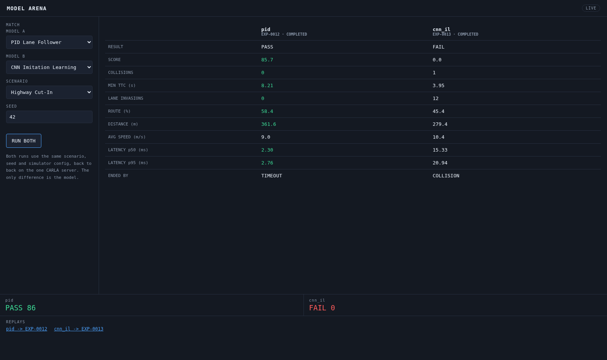

# Phase 12 - Model Arena

Goal: put two models on the same scenario and see which drives it better.

**Status: complete and passing.**



## What was built

| Path | Purpose |
|---|---|
| `backend/experiment_manager.py` | `start_sequence()` - runs experiments back to back |
| `backend/api/routes.py` | `POST /api/arena`, `GET /api/compare` |
| `frontend/app/arena/page.tsx` | The comparison page |
| `scripts/capture_arena.py` | Headless-browser verification |

## Design decisions

### The comparison is only worth anything if nothing else differs

`POST /api/arena` creates both experiments from one scenario id and one seed,
so neither model can get an easier run. `GET /api/compare` returns a `fair`
flag and refuses to imply a verdict when the two experiments do not share a
scenario and seed - it is possible to compare arbitrary experiment ids, and it
should be obvious when that is not a like-for-like result.

### Sequential, not parallel, and deliberately

There is one CARLA server. Two episodes sharing it would interleave their
world ticks and corrupt both, so `start_sequence()` runs them on a single
worker thread, one after the other. Parallel matches need the second simulator
from Phase 13.

### The winner is marked per metric, not overall

Each row knows whether higher or lower is better and highlights the better
side. There is deliberately no single "winner" banner: a model can win on
score and lose badly on latency, and flattening that into one word hides the
interesting part.

## Acceptance results

The expert against the learned model, identical scenario and seed:

```
$ curl -X POST localhost:8000/api/arena \
    -d '{"model_a":"pid","model_b":"cnn_il","scenario_id":"highway_cut_in_001","seed":42}'
{"scenario_id": "highway_cut_in_001", "seed": 42,
 "experiment_a": "EXP-0010", "experiment_b": "EXP-0011"}

$ curl "localhost:8000/api/compare?a=EXP-0010&b=EXP-0011"
fair comparison: True | scenario highway_cut_in_001 seed 42

                                    pid             cnn_il
RESULT                             PASS               FAIL
SCORE                             85.62               0.00
COLLISIONS                            0                  1
MIN TTC                            7.06               4.55
LANE INVASIONS                        0                 12
ROUTE %                           58.10              42.33
DISTANCE m                       359.21             260.06
LATENCY p50 ms                     2.32              17.07
LATENCY p95 ms                     2.78              20.19
ENDED BY                        TIMEOUT          COLLISION
```

Status transitions observed while polling, showing the runs are serialised:

```
t+5s   RUNNING   STARTING
t+20s  COMPLETED RUNNING
t+40s  COMPLETED COMPLETED
```

Verified in a real browser end to end - the script selects both models, clicks
RUN BOTH, and waits for both experiments to reach a terminal state before
photographing:

```
$ uv run python scripts/capture_arena.py --a pid --b cnn_il
captured docs/images/arena.png
```

The latency column is the part that only a platform can tell you: the rule-based
expert answers in 2.3 ms, the neural policy in 15-17 ms. Both are far inside the
500 ms budget, but they are an order of magnitude apart, and that is a real
deployment consideration the score alone never surfaces.

## Known issues

1. **No live view during a match.** The page polls `/api/compare` and shows the
   table; it does not stream either car. Both experiments have live telemetry
   sockets, so a two-pane arena view is possible - it just is not built.
2. **Two models per match.** The endpoint takes exactly `model_a` and
   `model_b`; a league table over N models is Phase 14 territory.
3. **A match is a single seed.** One episode is a sample of one, and Phase 11
   showed how differently a model can behave when it drifts off-distribution.
   Aggregating over seeds is Phase 14.
4. **Nothing records that two experiments formed a match.** The pairing lives
   in the URL rather than in the database, so a match cannot be looked up later
   by id - only its two experiments can.
