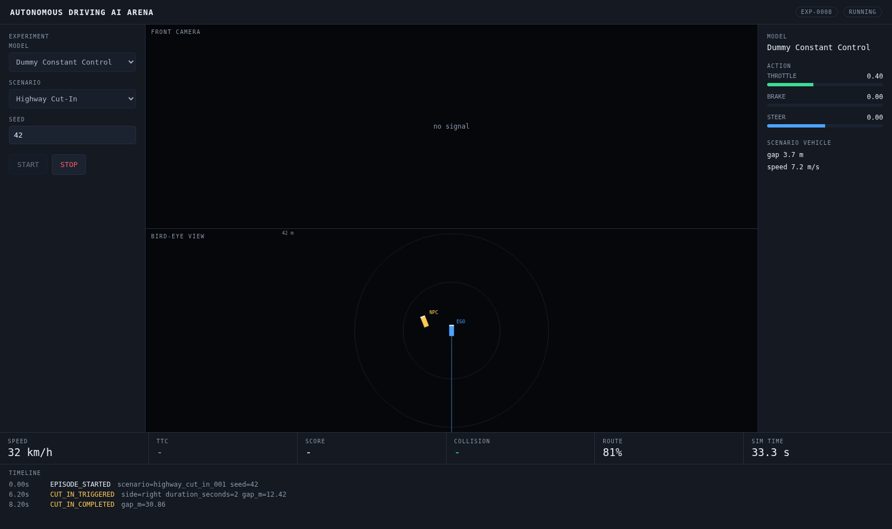

# Phase 7 - Frontend

Goal: watch an episode happen, live, and start/stop it from a browser.

**Status: complete and passing.** Acceptance was "real-time data is correct
before it is pretty"; the dashboard drives a full experiment, streams the
camera and telemetry, and shows the verdict.



## What was built

| Path | Purpose |
|---|---|
| `simulator/stream.py` | `Broadcaster` - per-tick fan-out from the worker thread |
| `backend/api/websocket.py` | `/ws/experiments/{id}/telemetry` |
| `frontend/app/page.tsx` | The dashboard |
| `frontend/components/BirdEyeView.tsx` | Canvas BEV (Phase 8, see PHASE8.md) |
| `frontend/lib/api.ts` | Typed client for the REST API and the socket |
| `scripts/fe-install.sh` | npm install onto local disk, linked into the repo |
| `scripts/capture_dashboard.py` | Headless-browser verification and screenshots |

## Design decisions

### One socket, not two

The spec sketches separate camera and telemetry channels. They are merged:
telemetry every tick, and a JPEG on the ticks where the camera actually fired.
Two sockets would have to be re-synchronised in the browser to draw a
consistent frame, for no gain.

Measured: 673 messages, 336 of them carrying a frame - exactly half, which is
the 10 Hz camera against the 20 Hz world. 27.4 KB per JPEG at quality 70.

### A slow browser must not stall the simulation

Subscribers get bounded queues. When one fills, the oldest message is dropped
and the newest kept. A live view wants the present, not a backlog, and the
physics loop must never wait on a socket.

### node_modules never lives on NFS

The repo is on NFS where opening each of thousands of small files costs
milliseconds. `scripts/fe-install.sh` runs npm in a staging directory on local
disk and symlinks the result in, because `npm install` deletes a symlink and
writes a real directory in its place - putting everything back on NFS
silently. The Next.js build output is redirected the same way via
`ARENA_NEXT_DIST`.

### Verified in a real browser, on a machine with no display

`scripts/capture_dashboard.py` drives headless Chromium: it clicks START,
waits for an actual `` camera frame to appear, and screenshots. Waiting on
the frame rather than a fixed sleep is what makes it a test - the image only
exists if CARLA, the gRPC model, the worker, the broadcaster, the socket and
React all worked.

## Bugs found and fixed

**The last event never reached the browser.** Terminating events - the
collision, the emergency stop - are logged *after* the final per-tick publish,
so the timeline showed the cut-in but never why the episode ended. The worker
now flushes pending events after the loop. Before and after, same episode:

```
before: events = EPISODE_STARTED, CUT_IN_TRIGGERED, CUT_IN_COMPLETED
after : events = EPISODE_STARTED, CUT_IN_TRIGGERED, CUT_IN_COMPLETED, COLLISION
```

**Next.js 15.1.6 ships a known CVE.** npm flagged CVE-2025-66478 on install;
pinned to 15.5.23 instead.

## Acceptance results

WebSocket, measured against a live episode:

```
$ python ws_test.py
created EXP-0007
started
stream ended
ticks=673 camera_frames=336 heartbeats=8
avg jpeg = 27.4 KB
first tick: {'sim_time': 0.0, 'speed_mps': 0.002, 'x': 405.217, 'y': -34.832, 'yaw': -89.56}
events: [(0.0, 'EPISODE_STARTED'), (6.05, 'CUT_IN_TRIGGERED'),
         (8.05, 'CUT_IN_COMPLETED'), (33.55, 'COLLISION')]
```

Headless browser, full round trip:

```
$ uv run python scripts/capture_dashboard.py
captured docs/images/dashboard-idle.png
first camera frame received in the browser
captured docs/images/dashboard-running.png
captured docs/images/dashboard-result.png
```

Production build:

```
Route (app)                                 Size  First Load JS
┌ ○ /                                    3.49 kB         106 kB
└ ○ /_not-found                            989 B         103 kB
+ First Load JS shared by all             102 kB
```

What the screenshots show, all of it live rather than mocked: the CARLA front
camera, the bird-eye view with ego and scenario vehicle, DummyAgent's constant
throttle 0.40 / brake 0.00 / steer 0.00, the cut-in gap of 2.8 m, the timeline
with `CUT_IN_TRIGGERED gap_m=12.15` and `COLLISION other_actor=static.guardrail`,
and the verdict `FAIL / score 0.0 / 100`.

## Known issues

1. **TTC reads `-` at the end of a run.** The status bar shows the *current*
   tick's TTC, and by the final tick nothing is ahead. The episode minimum is
   in the result panel (4.55 s). A running minimum in the status bar would be
   clearer.
2. **No replay yet.** The timeline only fills while an episode is live;
   reopening a finished experiment shows an empty timeline until Phase 9.
3. **No Tailwind or component library.** Plain CSS, because the spec asks for
   correct real-time data before visual polish. The layout follows the wireframe
   in spec section 52.
4. **Model list is not refreshed while running**, so a model registered through
   the API mid-session needs a page reload.

## Not in this phase

Replay of finished episodes (Phase 9) and the model-versus-model arena
(Phase 12).
