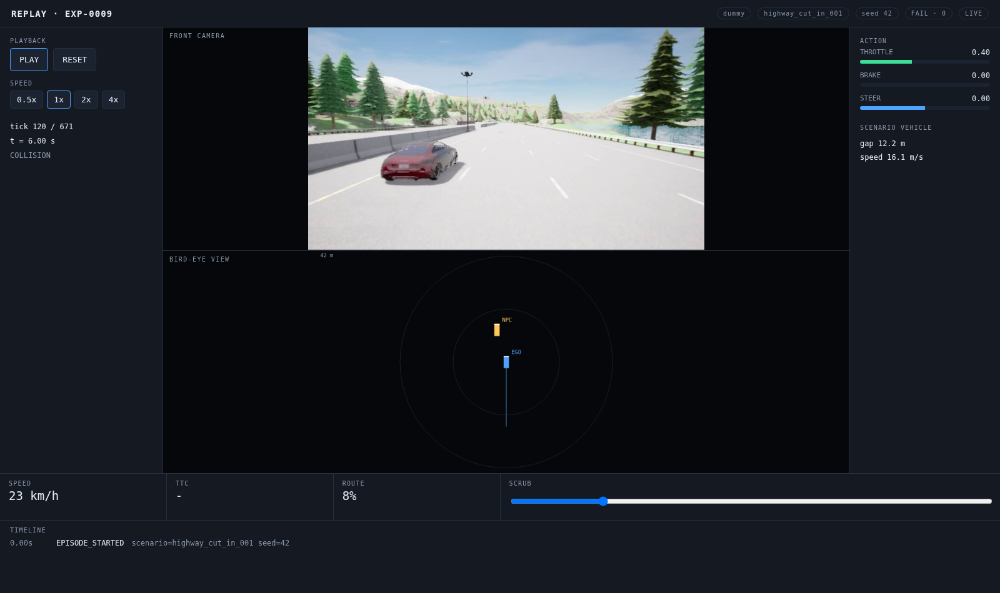

# Phase 9 - Replay

Goal: watch a finished episode again, in sync, after the fact.

**Status: complete and passing.**



That screenshot is the payoff of the whole build so far. It is paused at
**t = 6.00 s**: the recorded camera shows the red Audi cutting across in front
of the ego, the bird-eye view puts it dead ahead, and the side panel reads
**gap 12.2 m** - one tick before the trigger fires at 12.15 m. Camera,
telemetry, BEV and timeline are all showing the same instant.

## What was built

| Path | Purpose |
|---|---|
| `simulator/worker.py` | Opt-in JPEG frame recorder |
| `backend/migrations/` | Alembic, with a baseline and the frame-recording change |
| `backend/database/models.py` | `frames` table, `experiments.record_frames` |
| `backend/api/routes.py` | `GET .../replay` and `GET .../frames/{index}` |
| `frontend/app/replay/[id]/page.tsx` | Play / pause / scrub / speed |
| `scripts/capture_replay.py` | Headless-browser verification |

## Design decisions

### A recorded tick and a live tick are the same object

The replay page reuses `BirdEyeView` and the action bars unchanged. The live
dashboard is driven by a socket, the replay page by an array index, and
everything downstream reads the same tick shape. No parallel rendering path to
keep in sync.

### Recording is opt-in

337 frames at ~27 KB is 10 MB per episode. Useful for a demo, wasteful for a
sweep of 100 seeds, so `record_frames` is a per-experiment flag defaulting to
off. Images go to disk under `output/experiments/<id>/camera_front/`; the
database stores only their index and path (spec section 42).

### Encode once, use twice

The JPEG for the live socket and the JPEG written to disk are the same bytes.
Encoding is still gated on the camera having actually produced a frame, so a
10 Hz camera costs 10 encodes a second, not 20.

### Frames are held between ticks

Frames land at 10 Hz against 20 Hz ticks, so the player holds the most recent
frame rather than blanking on the ticks in between - the same rule the sensor
layer follows.

## Migrations, because dropping the database is not an answer

Adding `record_frames` broke the API immediately:

```
sqlalchemy.exc.ProgrammingError: (psycopg.errors.UndefinedColumn)
column experiments.record_frames does not exist
```

`Base.metadata.create_all()` creates missing *tables* and never alters existing
ones. It had quietly created the new `frames` table while leaving `experiments`
without its new column - a half-applied schema, which is exactly the drift that
migrations exist to prevent.

Alembic is now wired in. Startup calls `migrate()`, which:

- builds a **fresh** database from the models and stamps it at head - there is
  no value in replaying history to reach a schema you already have;
- stamps a **pre-existing** database at the `0001` baseline and upgrades it.

The alternative - dropping and recreating on every schema change - would throw
away recorded experiment results, which is a strange property for a platform
whose purpose is storing experiment results.

Verified on the live database, which had run every phase so far:

```
INFO  [alembic.runtime.migration] Running upgrade 0001 -> 0002, Frame recording
migrate -> upgraded
experiments columns include record_frames: True
frames table exists: True
existing experiments preserved: 8
```

The one-off cleanup of the orphan `frames` table left behind by `create_all()`
was done by hand; from here the migration chain owns the schema.

## Acceptance results

```
$ curl localhost:8000/api/experiments/EXP-0009/replay
experiment   EXP-0009 | result FAIL | score 0.0
ticks        672 | telemetry rows 672
has_frames   True | frame count 337
events       [(0.0, 'EPISODE_STARTED'), (6.05, 'CUT_IN_TRIGGERED'),
              (8.05, 'CUT_IN_COMPLETED'), (33.55, 'COLLISION')]
first frame  {'index': 1, 'tick': 0, 'sim_time': 0.0}

$ curl -o /dev/null -w '%{http_code} %{content_type} %{size_download}' \
    localhost:8000/api/experiments/EXP-0009/frames/1
200 image/jpeg 31109

$ curl -o /dev/null -w '%{http_code}' .../frames/99999
404
```

```
$ ls output/experiments/EXP-0009/
camera_front  episode.json  events.jsonl  frames.json  metrics.json  telemetry.jsonl
$ ls output/experiments/EXP-0009/camera_front | wc -l
337
$ du -sh output/experiments/EXP-0009
10M
```

Headless browser:

```
$ uv run python scripts/capture_replay.py EXP-0009
recorded frame rendered
after 6 s of playback: tick 120 / 671
captured docs/images/replay.png
```

120 ticks in 6 seconds is 20 ticks/s - real-time playback of a 20 Hz
recording, which is the clock being right rather than approximately right.

`make test`: **120 passed in 2.42s**.

## Bugs found

**The capture script clicked the page title.** `page.click("text=PLAY")` also
matches `REPLAY - EXP-0009` in the header, so playback never started and the
script timed out waiting for the button to say PAUSE. Now selected by role
with `exact=True`. A reminder that a substring selector on a short word is a
trap in a UI that repeats it.

## Known issues

1. **Frame serving is one request per frame.** Fine at 10 Hz over loopback;
   scrubbing quickly issues a lot of requests. A sprite sheet or a video
   container would be better for a remote viewer.
2. **The scrub bar is tick-indexed, not time-indexed.** They coincide at a
   fixed timestep, but a variable-rate recording would need real timestamps.
3. **Old experiments have no frames.** Recording was added in this phase, so
   anything run before it replays with telemetry and BEV but shows "camera was
   not recorded". That is the honest state rather than a blank panel.
4. **No downsampling on the replay payload.** A 672-tick episode ships all 672
   rows as JSON, which is fine here and would not be for a ten-minute episode.
